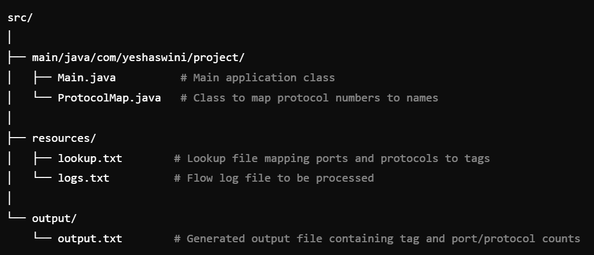

# Flow Log Processor

This Java application processes flow log data and generates an output file containing tag counts and port/protocol combination counts based on a provided lookup file.

## File Structure



## Assumptions Made

1. **Input File Format**: It is assumed that the lookup and flow log files follow the expected format:
    - The **lookup.txt** file should contain entries in the format: `destination_port, protocol, tag`, with each entry on a new line.
    - The **logs.txt** file should contain flow log entries in version 2 of the default format.
    - The protocol numbers in the flow logs are taken from the [AWS documentation on flow log records](https://docs.aws.amazon.com/vpc/latest/userguide/flow-log-records.html).

3. **Resource Availability**: It is assumed that the necessary resource files (lookup.txt and logs.txt) are present in the specified directory (`resources/`) and are accessible during program execution.

4. **Output Directory**: The program will write the output to `output/output.txt`, and it is assumed that the `output` directory exists prior to execution.

5. **Java Version**: The program is assumed to be run using Java 8 or higher, as it utilizes features available in those versions.

6. **Execution Environment**: The user is expected to have a Java development environment set up, including necessary permissions to read from input files and write to the output file.


## Description

The `Main.java` file contains the main logic for parsing flow logs and lookup data. The application uses two HashMaps to store tag counts and port/protocol combinations, and it generates an output file named `output.txt` in the `output/main/java/com/yeshaswini/project/` directory.

### Files

- **Main.java**: The main application that handles file input, processes data, and generates output.
- **ProtocolMap.java**: Maps protocol numbers to their respective names.
- **lookup.txt**: A text file in csv format containing mappings of destination ports and protocols to tags.
- **logs.txt**: A text file containing flow log entries to be processed.
- **output.txt**: The output file that contains the counts of tags and port/protocol combinations.

## Instructions

### Prerequisites

Ensure you have the following installed:
- Java Development Kit (JDK)
- Apache Maven (optional, for project management)
- The implementation does not require any external libraries or dependencies, aside from standard Java libraries.

### Compilation

To compile the Java files, navigate to the `src` directory and run:

```bash
javac -d output main/java/com/yeshaswini/project/*.java
```
### Execution

To run the application, execute the following command in the src directory:

```bash
java -cp output;resources main.java.com.yeshaswini.project.Main
```

### Input
Add the input files in the resouces folder (refer to the file structure).
I have added two sample input files in the `resources` directory named `lookup.txt` and `logs.txt`.
When prompted, enter the names of the lookup and logs files (e.g., lookup.txt and logs.txt). 
The application will read these files from the resources directory.


### Output
The output will be generated in the following file: (refer to the file structure)
output/output.txt

This file will contain two sections:

Tag Counts: Lists the count of occurrences for each tag.
Port/Protocol Combination Counts: Lists the count of occurrences for each unique port/protocol combination.

### Author
Yeshaswini Murthy
